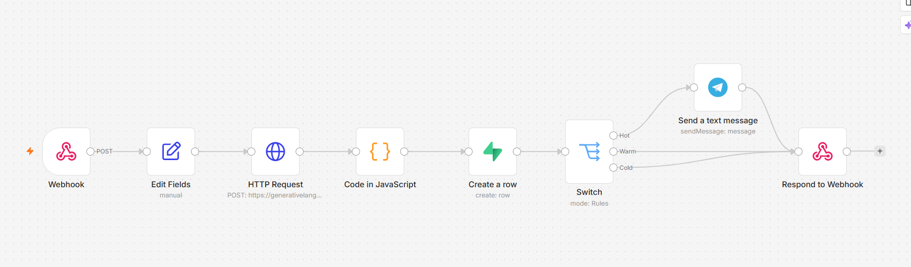
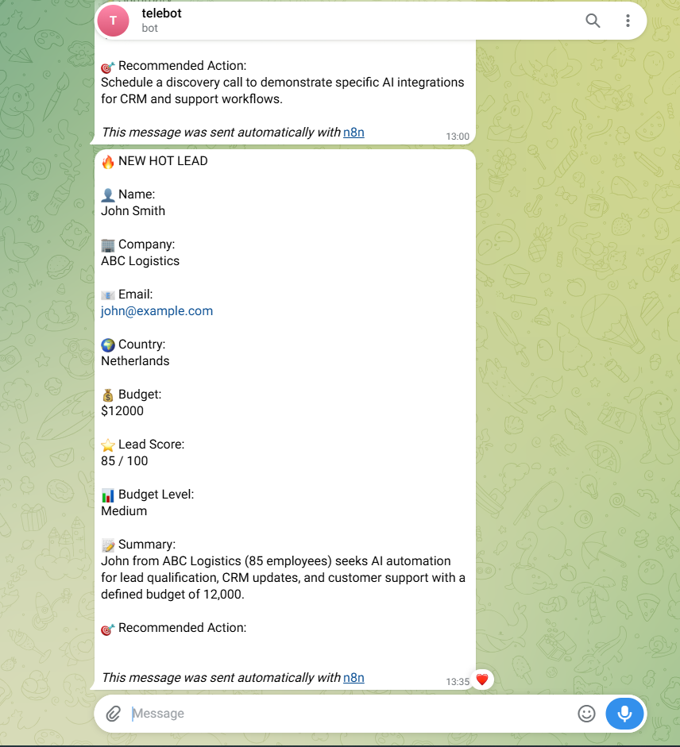
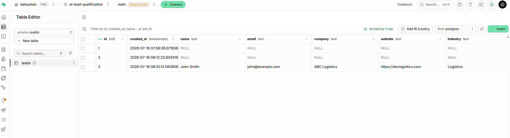

# AI Lead Qualification System

## Overview

This project is an AI-powered lead qualification workflow built with **n8n**, **Google Gemini AI**, **Supabase**, and **Telegram**.

It automatically analyzes incoming leads, calculates a lead score, classifies them as **Hot**, **Warm**, or **Cold**, stores all data in Supabase, and sends Telegram notifications for high-priority leads.

---

## Business Problem

Sales teams often receive many inquiries every day.

Manually reviewing and prioritizing each lead is time-consuming and may cause valuable opportunities to be missed.

This workflow automates the qualification process using AI.

---

## Features

- AI Lead Qualification
- Lead Scoring
- Hot / Warm / Cold Classification
- AI-generated Summary
- Recommended Next Action
- Supabase Database Storage
- Telegram Notification for Hot Leads
- Webhook API Endpoint

---

## Tech Stack

- n8n
- Google Gemini API
- Supabase
- Telegram Bot API

---

## Workflow

Webhook

↓

Gemini AI

↓

JavaScript Parsing

↓

Supabase Database

↓

Switch

├── Hot → Telegram

├── Warm

└── Cold

↓

Webhook Response

---

## Example Input

```json
{
  "name": "John Smith",
  "company": "ABC Logistics",
  "budget": 12000,
  "message": "We want to automate CRM and customer support."
}
```

## Example AI Output

```json
{
  "lead_score": 92,
  "lead_type": "Hot",
  "budget_level": "Medium",
  "summary": "Mid-sized logistics company interested in AI automation.",
  "recommended_action": "Schedule a discovery call."
}
```

## Result

The workflow automatically:

- receives incoming leads
- analyzes them with AI
- scores each lead
- stores data in Supabase
- alerts the sales team via Telegram for high-value opportunities

---
## Screenshots

### Workflow



### Telegram Notification



### Supabase Database


## Author

Built by Farangiz
